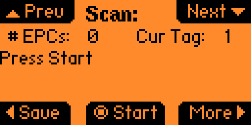
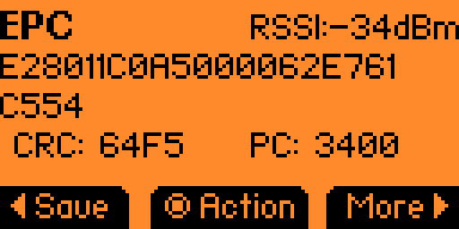
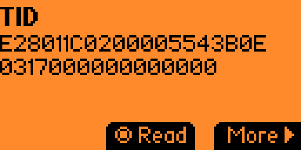
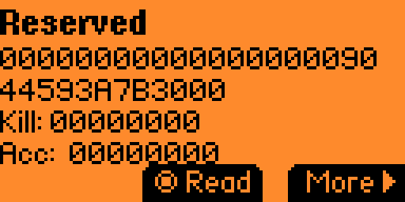
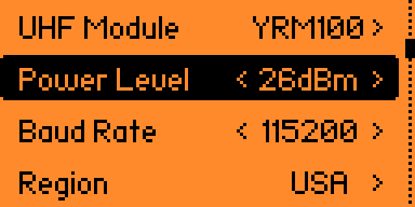
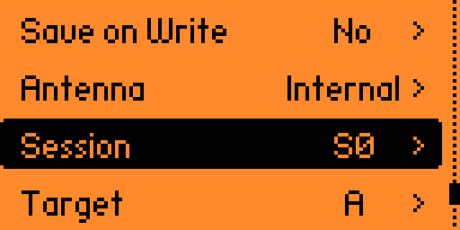

# Flipper Zero UHF RFID App 

**Please note that this is a fork of the original app from @haffnerriley with new features for YRM100X UHF Reader**

### New in v1.2.0

#### Multi-tag reading (YRM100)
- Read and view up to **50 simultaneous UHF RFID tags** with live EPC list updates during scan
- Cycle through detected tags with **Up / Down** on the scan screen

#### Per-bank memory screens (YRM100)
- From the EPC dump screen, press **Right (More)** to enter the per-bank memory screens
- Cycle through **TID → Reserved → User** banks with Right; wraps back to the EPC dump
- Press **OK** to read the currently shown bank from the selected tag
- **Up / Down** scrolls long hex dumps (e.g. large User memory)
- Reserved bank screen shows the raw hex plus decoded **Kill** and **Access** passwords as scrollable lines

#### EPC dump screen rework
- EPC wraps at 20 chars/line, CRC and PC on one row, RSSI with dBm unit
- **Left = Save**, **Center = Action** (Write / Lock / Kill), **Right = More** (→ bank screens)

#### Save system
- Save a tag from the scan screen (**Left**), EPC dump (**Left**)

#### Configuration
- Set power level from 0 - 27 dBm, in increment of 1 dBm
- Set Session S0,S1,S2,S3
- Set Target A/B
- Flipper will load the current configuration in the YRM100 reader during first connect instead of using default 
- Flipper will check the ACK from the YRM100 reader when setting configuration

## Overview
This app is designed to work with the M6e Nano, M7E Hecto, and YRM100 UHF RFID Readers and the Flipper Zero. This app supports reading up to 150 tags per second (M6E & M7E only), writing to tags (EPC, TID, Reserved, and User Memory Banks), viewing all tag information, saving tags, and more! 

**Please note that all values scroll across the screen.

## Special Note for M6E & M7E Users
Currently, not all features work for the M6E & M7E. In the next release, support for locking, killing, and reading PC/CRC will be added for the M6E & M7E. Stay on the first version of the app to have a more stable version of the app. 

## Coming Soon
 In the future, I plan on developing a custom pcb that utilizes the M6e Nano module offering a powerful UHF Reader that plugs right into the Flipper Zero! Some other feature enhancements to the configuration menu will also be added in the future including antenna selection, saving configuration menu settings, and selecting/detecting/setting custom UHF RFID tag types (adjusting read/write size for memory banks).
 
## Features
- Read and view up to 150 UHF RFID tags at once (M6E & M7E Only)!
  - EPC, TID, User, and Reserved Memory Banks
  - Can cycle through multiple tags from a single read!
- Save, rename, delete and view UHF tags on your flipper!
  - EPC, TID, User, and Reserved Memory Banks
- Write UHF tags 
  - EPC Memory Bank
  - TID Memory Bank (not supported if tag is locked)
  - User Memory Bank
  - Reserved Memory Bank 
- Lock UHF Tags
  - Lock each memory bank of the UHF Tag (assuming you know the access password, and the tag isn't permanently locked/unlocked)
  - Set access password 
- Kill UHF Tags
  - Set the kill password
  - Permanently inactivate a tag 
- UHF RFID Reader Configuration
  - Set RF Power
  - Set UHF Module
  - Set Baud Rate
  - Set Region
  - Set default access password used for reading/writing/locking operations
  - Save on Write (Set this to Yes if you want saved tags to update after writing to them)
  - Set antenna type (WIP)
- Features coming soon: 
  - Set custom size for user/reserved memory banks to read
  - Custom PCB with M6e Nano module and external antenna support!
  - Adding support for new features for the M6E & M7E

## Hardware Requirements

Currently, this Flipper Zero application requires an [M6e Nano](https://www.jadaktech.com/product/thingmagic-m6e-nano-uhf-rain-rfid/) compatible UHF RFID Reader. I recommend one of the following options:
- [SparkFun Simultaneous RFID Reader](https://www.sparkfun.com/products/14066)
- The [M7E Hecto](https://www.sparkfun.com/products/24738) that just came out should work too, however, this I haven't been able to test.
- The [YRM100](https://www.alibaba.com/product-detail/Invelion-YRM-1001-The-antenna-is_1600873986609.html) Is now supported for all features!

Additionally, if you are using a M6E or M7E, a [Raspberry Pi Zero](https://www.adafruit.com/product/2885) is required in order to run the [ThingMagic Mercury API](https://github.com/gotthardp/python-mercuryapi)
- I hope to eliminate the need for the RPi, however, I thought having it could allow for easier adoption of different UHF RFID readers. 

Also, you need the Flipper Zero which is available from [Flipper Devices](https://www.flipperdevices.com).

## Setup and Installation

1. Clone this GitHub repository to the `applications_user` folder of your Flipper Zero using the firmware of your choice.
2. Using VSCode with the desired firmware:
     - Press `Ctrl+Shift+B` in VScode inside the simultaneous_rfid_reader folder
     - Select the `Launch App on Flipper` option
     - If you do not have VScode you can use the following command in your terminal `./fbt COMPACT=1 DEBUG=0 launch APPSRC=applications_user\simultaneous_rfid_reader`
3. Now that you have the app set up, you can follow the instructions below to get the Raspberry Pi Zero working correctly (M6E & M7E Users Only!).

## YRM100 Wiring

1. To connect the YRM100 to the FLipperZero, just follow the schematic above. Then the module should be ready to commuicate over UART!

## UHF RFID Reader & Raspberry Pi Zero Setup (M6E & M7E Users Only!)

### Hardware Setup:
1. Connect the M6e/M7e Nano reader to the Raspberry Pi GPIO pins:
  - TX on the M6e/M7e should connect to GPIO pin 15 on the Raspberry Pi Zero
  - RX on the M6e/M7e should connect to GPIO pin 14 on the Raspberry Pi Zero
  - Ground on the M6e/M7e should connect to ground on the Raspberry Pi Zero

2. Connect the Flipper Zero to the Raspberry Pi GPIO Pins:
  - TX (pin 13) on the Flipper Zero should connect to GPIO pin 27 on the Raspberry Pi Zero
  - RX (pin 14) on the Flipper Zero should connect to GPIO pin 17 on the Raspberry Pi Zero
  - Ground on the Flipper Zero should connect to ground on the Raspberry Pi Zero

### Software Setup
1. Ensure that your Raspberry Pi Zero is flashed with a proper OS such as Raspberry Pi OS. 
2. Install the [Python wrapper](https://github.com/gotthardp/python-mercuryapi/blob/master/README.md) for the ThingMagic Mercury API on the Raspberry Pi Zero. 
3. Download the `pi-zero-uhf.py` program to your Raspberry Pi Zero. 
4. Install the `soft_uart` module using the instructions in the README from this [GitHub repository](https://github.com/adrianomarto/soft_uart).
5. Add the following lines to the end of your rc.local file using `sudo nano /etc/rc.local`:
  - `/sbin/insmod /Path/To/soft_uart.ko`
  - `sudo python /Path/To/pi-zero-uhf.py &`
6. Reboot the Raspberry Pi Zero and now the virtual serial port and UHF RFID program will run on boot!

## Acknowledgements

I found a few resources useful while developing this app:

1. The `uart_helper`, and `ring_buffer` source and header files from [Derek Jamison](https://github.com/jamisonderek/flipper-zero-tutorials/blob/main/gpio/uart_demo/uart_helper.c) made the communication process between the Flipper Zero and the Raspberry Pi Zero much easier. 

2. The entire Flipper Zero Tutorials [GitHub](https://github.com/jamisonderek/flipper-zero-tutorials/tree/main) was a great resource for learning how to develop a Flipper Zero application. 

3. The [Python Wrapper](https://github.com/gotthardp/python-mercuryapi/tree/master) for the ThingMagic Mercury API is a great tool for working with any ThingMagic readers. 

4. The `soft_uart` module was super helpful for creating another serial port on the [Raspberry Pi Zero](https://github.com/adrianomarto/soft_uart). 

5. Most of the functionality for reading, writing, and interacting with the YRM100 module was modified from [Frux-C's](https://github.com/frux-c/uhf_rfid) UHF-RFID App for the FlipperZero. 

## Contributions

Feel free to reach out, or open a PR for bug fixes, ideas, or new feature requests. This application is still a work in progress, so I am open to new ideas or areas for improvement!

## Disclaimer

- I am not responsible for any damage or loss caused by the usage of this app.
- This app will be updated in the future and may contain bugs that haven't been spotted due to my testing environment and hardware setup. 

## Contact

Riley Haffner

wrh@rileyhaffner.com
